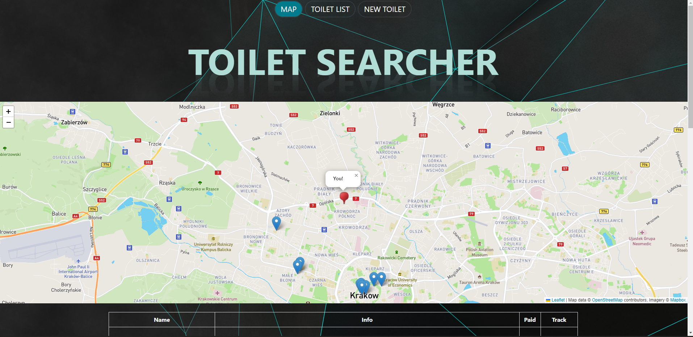

# Database-Project-AGH-UST
Authors: Jakub Łubkowski, Szymon Słota, Sebastian Kozak

Topic: 
 - Toilet searcher

Technology:
 - database: Atlas (MongoDb)
 - backend: Spring (Java)
 - frontend: Angular (TypeScript)

Description:
 - Web application for finding and reporting public toilets.

